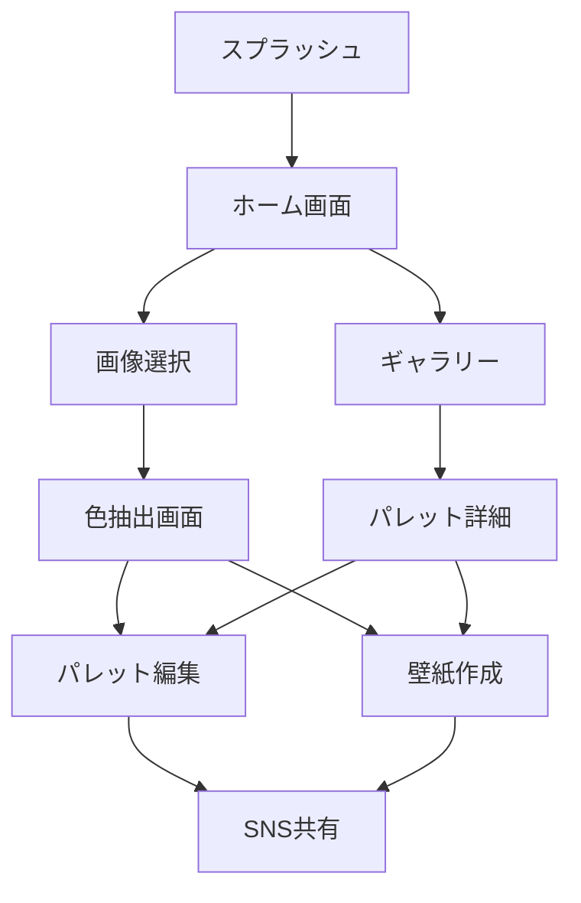

# 推しパレ - 開発要件定義書

## 1. アプリケーション概要

### 1.1 コンセプト
「推しパレ」は、画像から主要な色を抽出し、その色情報を活用して創造的なコンテンツを生成・共有できるiOSアプリケーションです。

### 1.2 ターゲットユーザー
- **メインターゲット**: 15-35歳のSNSアクティブユーザー
- **サブターゲット**: デザイナー、イラストレーター、推し活ユーザー
- **ペルソナ**: 推しの写真や好きな風景から色を抽出し、オリジナルコンテンツを作りたい創造的なユーザー

### 1.3 主要機能
1. **カラーパレット抽出**: 画像から主要5色を自動抽出
2. **パレット画像生成**: SNS共有用のおしゃれなパレット画像を自動生成
3. **グラデーション壁紙生成**: 抽出色を使用した美しいグラデーション壁紙作成
4. **SNS共有**: 生成コンテンツの簡単共有機能

## 2. 技術仕様

### 2.1 開発環境
- **言語**: Swift 5.9+
- **フレームワーク**: SwiftUI
- **最小対応OS**: iOS 16.0
- **開発ツール**: Xcode 15.0+
- **アーキテクチャ**: MVVM + Clean Architecture

### 2.2 使用ライブラリ・フレームワーク
```swift
// Core
- SwiftUI
- Combine
- CoreImage // 画像処理
- Vision // 画像解析
- PhotosUI // 写真ライブラリアクセス

// 外部ライブラリ (Swift Package Manager)
- ColorKit // 高度な色処理
- Lottie // アニメーション
- SwiftLint // コード品質管理
```

## 3. データモデル設計

### 3.1 Core Data Models

```swift
// カラーパレットモデル
struct ColorPalette: Codable, Identifiable {
    let id: UUID
    let createdAt: Date
    let sourceImageData: Data?
    let colors: [ExtractedColor]
    let title: String?
    let tags: [String]
}

// 抽出色モデル
struct ExtractedColor: Codable, Identifiable {
    let id: UUID
    let hexCode: String
    let rgb: RGBColor
    let hsl: HSLColor
    let percentage: Double // 画像内での占有率
    let name: String? // 色の名前（オプション）
}

// RGB色空間
struct RGBColor: Codable {
    let red: Double
    let green: Double
    let blue: Double
}

// HSL色空間
struct HSLColor: Codable {
    let hue: Double
    let saturation: Double
    let lightness: Double
}

// 壁紙設定モデル
struct WallpaperSettings: Codable {
    let gradientType: GradientType
    let orientation: GradientOrientation
    let deviceSize: DeviceSize
    let includeColorCodes: Bool
}

enum GradientType: String, Codable, CaseIterable {
    case linear = "linear"
    case radial = "radial"
    case angular = "angular"
    case diamond = "diamond"
}

enum GradientOrientation: String, Codable, CaseIterable {
    case vertical = "vertical"
    case horizontal = "horizontal"
    case diagonal = "diagonal"
    case custom = "custom"
}
```

### 3.2 永続化戦略
- **Core Data**: お気に入りパレット、履歴
- **UserDefaults**: アプリ設定、ユーザープリファレンス
- **FileManager**: 生成画像の一時保存
- **iCloud同期**: パレットコレクションの同期（オプション）

## 4. ディレクトリ構成

```
OshiPalette/
├── App/
│   ├── OshiPaletteApp.swift
│   ├── AppDelegate.swift
│   └── ContentView.swift
│
├── Core/
│   ├── Models/
│   │   ├── ColorPalette.swift
│   │   ├── ExtractedColor.swift
│   │   └── WallpaperSettings.swift
│   │
│   ├── Services/
│   │   ├── ColorExtractionService.swift
│   │   ├── ImageProcessingService.swift
│   │   ├── PaletteGeneratorService.swift
│   │   └── WallpaperGeneratorService.swift
│   │
│   └── Utilities/
│       ├── ColorConverter.swift
│       ├── ImageCache.swift
│       └── HapticManager.swift
│
├── Features/
│   ├── Home/
│   │   ├── Views/
│   │   │   ├── HomeView.swift
│   │   │   └── QuickActionCard.swift
│   │   └── ViewModels/
│   │       └── HomeViewModel.swift
│   │
│   ├── ColorExtraction/
│   │   ├── Views/
│   │   │   ├── ImagePickerView.swift
│   │   │   ├── ColorExtractionView.swift
│   │   │   └── ColorDetailSheet.swift
│   │   └── ViewModels/
│   │       └── ColorExtractionViewModel.swift
│   │
│   ├── PaletteEditor/
│   │   ├── Views/
│   │   │   ├── PaletteEditorView.swift
│   │   │   ├── ColorAdjustmentView.swift
│   │   │   └── TemplateSelectionView.swift
│   │   └── ViewModels/
│   │       └── PaletteEditorViewModel.swift
│   │
│   ├── WallpaperCreator/
│   │   ├── Views/
│   │   │   ├── WallpaperCreatorView.swift
│   │   │   ├── GradientPreviewView.swift
│   │   │   └── DeviceMockupView.swift
│   │   └── ViewModels/
│   │       └── WallpaperCreatorViewModel.swift
│   │
│   └── Gallery/
│       ├── Views/
│       │   ├── GalleryView.swift
│       │   ├── PaletteGridItem.swift
│       │   └── PaletteDetailView.swift
│       └── ViewModels/
│           └── GalleryViewModel.swift
│
├── Shared/
│   ├── Components/
│   │   ├── ColorCircle.swift
│   │   ├── GradientBackground.swift
│   │   ├── ShareSheet.swift
│   │   └── LoadingOverlay.swift
│   │
│   ├── Extensions/
│   │   ├── Color+Extensions.swift
│   │   ├── UIImage+Extensions.swift
│   │   └── View+Extensions.swift
│   │
│   └── Modifiers/
│       ├── CardModifier.swift
│       ├── ShimmerModifier.swift
│       └── ParallaxModifier.swift
│
├── Resources/
│   ├── Assets.xcassets/
│   ├── Animations/ // Lottieアニメーション
│   ├── Fonts/
│   └── Localizations/
│
└── Supporting Files/
    ├── Info.plist
    └── OshiPalette.entitlements
```

## 5. UI/UX設計

### 5.1 画面遷移フロー



### 5.2 主要画面仕様

#### 5.2.1 ホーム画面
- **デザイン**: カード型UI、グラスモーフィズム
- **アニメーション**: 
  - 起動時: スケールイン + フェードイン
  - カード: ホバーエフェクト（3D回転）
- **機能ボタン**:
  - 「写真から抽出」（カメラ/ライブラリ選択）
  - 「最近のパレット」
  - 「トレンドカラー」（SNS連携）

#### 5.2.2 色抽出画面
- **リアルタイム処理**: 画像選択後即座に色抽出
- **インタラクション**:
  - 色をタップで詳細表示（HEX, RGB, HSL）
  - ドラッグで色の順序変更
  - ピンチで画像ズーム
- **アニメーション**:
  - 色の出現: スタガードアニメーション
  - 成功時: パーティクルエフェクト

#### 5.2.3 パレット編集画面
- **テンプレート選択**:
  - ミニマル
  - ポップ
  - エレガント
  - レトロ
  - カスタム
- **編集機能**:
  - 色の微調整（明度・彩度）
  - テキスト追加
  - 背景パターン選択

#### 5.2.4 壁紙作成画面
- **プレビュー**: 実機モックアップ表示
- **カスタマイズ**:
  - グラデーション種類（線形、放射、角度）
  - ブレンドモード
  - ノイズテクスチャ追加
- **デバイス最適化**: 
  - iPhone各機種対応
  - ダークモード/ライトモード生成

### 5.3 マイクロインタラクション
- **触覚フィードバック**: 
  - 軽: 色選択時
  - 中: 保存成功時
  - 重: エラー時
- **サウンド**: 
  - 色抽出完了音
  - 保存音
  - シェア音
- **トランジション**:
  - 画面遷移: スプリングアニメーション
  - モーダル: ボトムシート式
  - 削除: スワイプトゥデリート

## 6. SNS連携とバズ要素

### 6.1 共有機能
- **対応SNS**:
  - Instagram（ストーリー/フィード）
  - X（Twitter）
  - TikTok
  - Pinterest
- **共有形式**:
  - 画像（正方形/縦長/横長）
  - 動画（色の変化アニメーション）
  - ARフィルター（Instagram）

### 6.2 バズを生む仕組み
- **ハッシュタグ自動生成**: 
  - #推しパレ
  - #ColorPalette
  - 色名ハッシュタグ
- **トレンド機能**:
  - 今週の人気パレット
  - 季節のおすすめ色
  - 有名人/作品の色分析
- **チャレンジ企画**:
  - 「推しの色を見つけよう」
  - 「部屋の色パレット」
  - 「今日のコーデカラー」

### 6.3 ユーザー生成コンテンツ（UGC）促進
- **テンプレート提供**: SNS投稿用テンプレート
- **ウォーターマーク**: アプリ名を控えめに表示
- **投稿インセンティブ**: 
  - 投稿数でアンロック機能
  - 限定テンプレート
  - プロ機能の期間限定解放

## 7. パフォーマンス要件

### 7.1 処理速度
- 画像読み込み: < 1秒
- 色抽出処理: < 2秒
- パレット画像生成: < 1秒
- 壁紙生成: < 3秒

### 7.2 メモリ管理
- 画像キャッシュ: 最大50MB
- 処理中画像: 最大解像度4096x4096
- バックグラウンド処理: 自動メモリ解放

### 7.3 バッテリー効率
- GPUアクセラレーション活用
- バックグラウンド処理の最小化
- 不要なアニメーションの自動停止

## 8. セキュリティ・プライバシー

### 8.1 データ保護
- 画像: ローカル処理（サーバー送信なし）
- 個人情報: 収集しない
- 解析: 匿名化された使用統計のみ

### 8.2 権限要求
- フォトライブラリ: 画像選択時のみ
- カメラ: オプション機能
- 通知: オプション（新機能案内）

## 9. マネタイズ戦略

### 9.1 基本無料モデル
- **無料機能**:
  - 基本的な色抽出（1日10回）
  - 標準テンプレート3種
  - 基本壁紙生成

### 9.2 プレミアム機能
- **OshiPalette Pro**（月額480円）:
  - 無制限色抽出
  - 全テンプレート解放
  - 高解像度出力
  - 広告非表示
  - クラウド同期
  - AI色名生成

## 10. 開発スケジュール

### Phase 1: MVP（2ヶ月）
- 基本的な色抽出機能
- シンプルなパレット表示
- 画像保存機能

### Phase 2: 拡張機能（1ヶ月）
- 壁紙生成機能
- SNS共有機能
- 基本的なテンプレート

### Phase 3: プレミアム機能（1ヶ月）
- 高度な編集機能
- クラウド同期
- 課金システム

### Phase 4: グロース施策（継続）
- A/Bテスト
- ユーザーフィードバック反映
- 新機能追加

## 11. 成功指標（KPI）

### 11.1 ユーザー指標
- DAU/MAU比率: 40%以上
- 7日間継続率: 30%以上
- 30日間継続率: 15%以上

### 11.2 エンゲージメント指標
- 1セッションあたりの色抽出数: 3回以上
- SNS共有率: 20%以上
- UGC生成数: 月間1000投稿

### 11.3 収益指標
- 有料会員転換率: 5%以上
- ARPU: 50円以上
- LTV: 2000円以上

## 12. 技術的考慮事項

### 12.1 色抽出アルゴリズム
```swift
// K-means クラスタリング実装
// 1. 画像のピクセルデータ取得
// 2. 色空間での距離計算（CIE Lab推奨）
// 3. クラスタ中心の更新
// 4. 収束まで繰り返し
// 5. 各クラスタの代表色を抽出
```

### 12.2 最適化戦略
- **画像処理**: Metal Performance Shaders使用
- **並列処理**: Grand Central Dispatch活用
- **キャッシング**: NSCache実装
- **遅延読み込み**: 必要時のみリソース読み込み

### 12.3 テスト戦略
- **単体テスト**: 色変換ロジック、データモデル
- **統合テスト**: サービス層の連携
- **UIテスト**: 主要フローの自動テスト
- **パフォーマンステスト**: 処理速度、メモリ使用量

## 13. 将来的な拡張可能性

### 13.1 AI/ML統合
- 色の感情分析
- 自動配色提案
- 画像内オブジェクト認識による色抽出

### 13.2 コミュニティ機能
- パレット共有プラットフォーム
- ユーザー間でのいいね/フォロー
- 色のトレンド分析

### 13.3 外部連携
- Adobe Creative Cloud連携
- Figma/Sketch プラグイン
- Web版の提供

## 14. リスク管理

### 14.1 技術的リスク
- **リスク**: 色抽出精度の低下
- **対策**: 複数アルゴリズムの併用、ユーザーフィードバック収集

### 14.2 市場リスク
- **リスク**: 競合アプリの出現
- **対策**: 独自機能の継続開発、コミュニティ形成

### 14.3 運用リスク
- **リスク**: サーバーコスト増大
- **対策**: ローカル処理優先、効率的なキャッシング

---

*Last Updated: 2025-08-14*
*Version: 1.0.0*